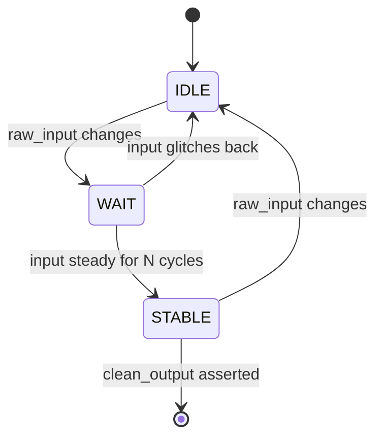
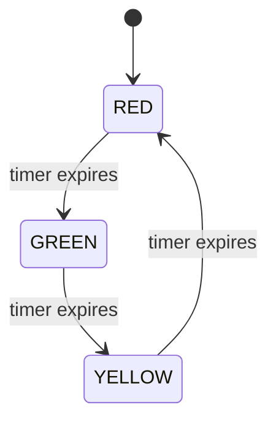
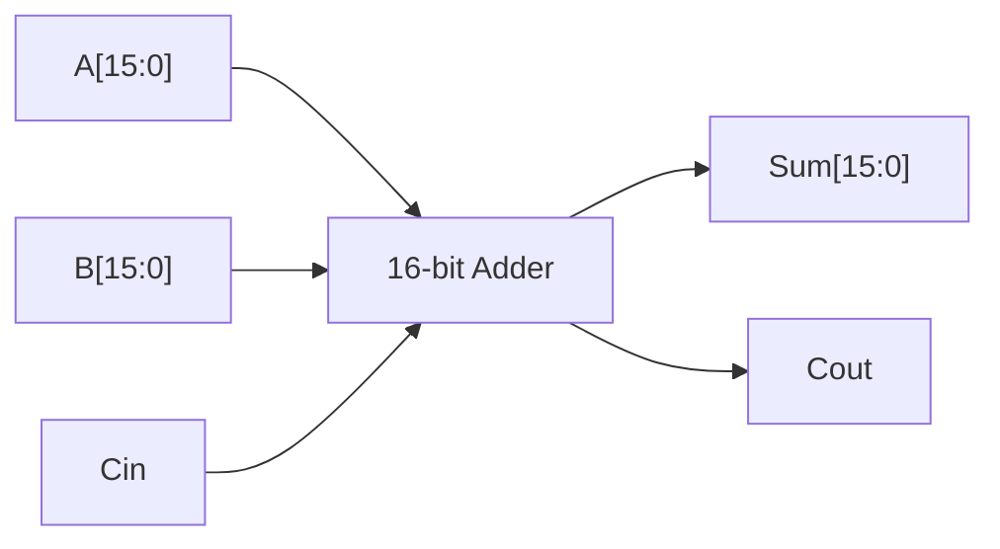

# 🔧 ChipVerify Hardware Challenge — Solutions

<div align="center">


**My RTL solutions to the [ChipVerify Hardware Design Challenges](https://www.chipverify.com/)** — a set of classic digital design problems solved in Verilog, one module at a time.

</div>

---

## 📚 Table of Contents

- [Overview](#-overview)
- [Progress Tracker](#-progress-tracker)
- [Repo Structure](#-repo-structure)
- [Solutions](#-solutions)
  - [1️⃣ Debouncer](#1️⃣-debouncer)
  - [2️⃣ Traffic Light FSM](#2️⃣-traffic-light-fsm)
  - [3️⃣ 16-bit Adder](#3️⃣-16-bit-adder)
  - [4️⃣ 4-Channel Countdown Timer](#4️⃣-4-channel-countdown-timer-)
  - [5️⃣ Vending Machine FSM](#5️⃣-vending-machine-fsm-)
- [Tools Used](#️-tools-used)
- [About Me](#-about-me)

---

## 🧠 Overview

This repo is my personal playground for the **ChipVerify Hardware Design Challenge** series — five bite-sized but classic digital design problems that show up everywhere from interview whiteboards to real silicon. Each solution is written in **plain Verilog**, kept clean and well-commented, and organized into its own folder.

Think of this as a running logbook of RTL muscle-memory: debouncing a noisy switch today, arbitrating a vending machine tomorrow.

---

## 📊 Progress Tracker

| # | Challenge | Status | Difficulty |
|---|-----------|:------:|:----------:|
| 1 | Debouncer | ✅ Done | 🟢 Easy |
| 2 | Traffic Light FSM | ✅ Done | 🟡 Medium |
| 3 | 16-bit Adder | ✅ Done | 🟢 Easy |
| 4 | 4-Channel Countdown Timer | ⏳ In Progress | 🟡 Medium |
| 5 | Vending Machine FSM | ⏳ In Progress | 🔴 Hard |

```
Progress: [███████████████░░░░░░░░░] 60% (3/5 solved)
```

---

## 🗂️ Repo Structure

```
ChipVerify-hardware-challenge/
├── 01_debouncer/
│   └── debouncer.v
├── 02_traffic_light_fsm/
│   └── traffic_light_fsm.v
├── 03_16bit_adder/
│   └── adder_16bit.v
├── 04_countdown_timer/           # 🚧 coming soon
└── 05_vending_machine_fsm/       # 🚧 coming soon
```

---

## 🧩 Solutions

### 1️⃣ Debouncer

A classic mechanical-switch debouncer — filters out the noisy, bouncy glitches a raw button press generates before they hit the rest of the digital system.



**Core idea:** sample the raw input on every clock edge, and only propagate a change to the output once it has stayed stable for a fixed number of cycles (a simple shift-register / counter-based debounce).

📁 [`01_debouncer/`](./01_debouncer)

---

### 2️⃣ Traffic Light FSM

A textbook Moore FSM cycling a traffic signal through its states on a timer.



**Core idea:** each state drives its own light output combinationally, and a countdown counter (loaded with a state-specific duration) triggers each transition.

📁 [`02_traffic_light_fsm/`](./02_traffic_light_fsm)

---

### 3️⃣ 16-bit Adder

A ripple-style 16-bit adder built from smaller full-adder blocks, propagating carry from LSB to MSB.



**Core idea:** compose the 16-bit add from cascaded smaller adder stages, with carry rippling from the least significant bit through to the most significant, plus a final carry-out flag for overflow detection.

📁 [`03_16bit_adder/`](./03_16bit_adder)

---

### 4️⃣ 4-Channel Countdown Timer 🚧

*Coming soon — a multi-channel countdown timer running four independent count sequences in parallel.*

---

### 5️⃣ Vending Machine FSM 🚧

*Coming soon — a Moore/Mealy FSM tracking inserted coins, dispensing product, and returning change.*

---

## 🛠️ Tools Used

- **HDL:** Verilog
- **Simulation:** *(add your simulator here — e.g. Icarus Verilog / ModelSim / Vivado XSim)*
- **Reference:** [ChipVerify](https://www.chipverify.com/) design challenge problem statements

---

## 👤 About Me

**Sundaravadivelan Karthikeyan**
Final-year ECE (Honors in Embedded Systems) student | RTL Design & Verification enthusiast

🔗 [GitHub — @Sundar13905](https://github.com/Sundar13905)

---

<div align="center">

⭐ *If you find this useful, drop a star — more solutions incoming!* ⭐

</div>
