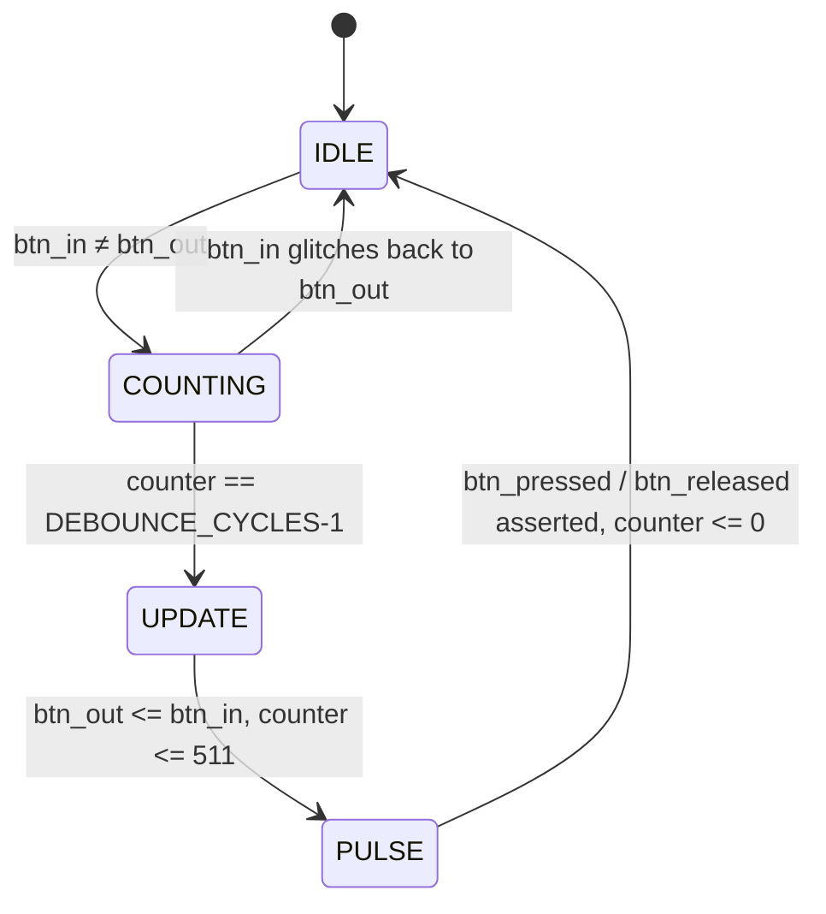
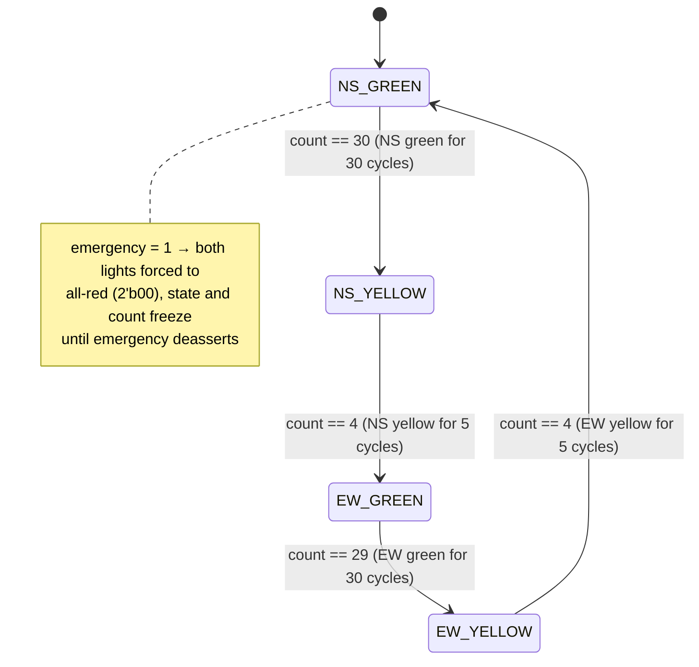
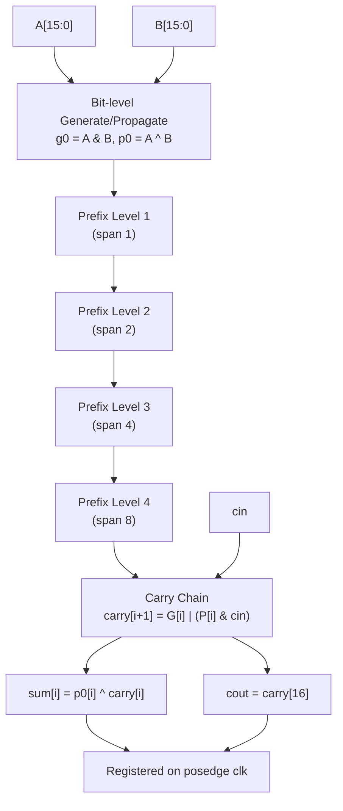
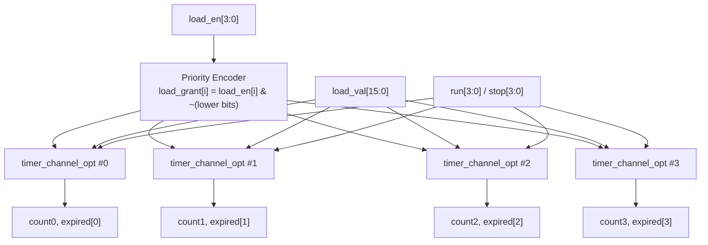
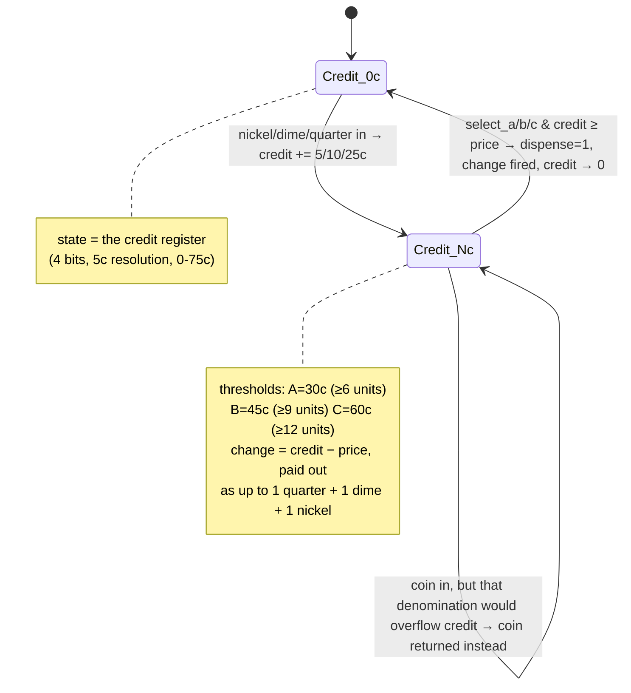

# 🔧 ChipVerify Hardware Challenge — Solutions

<div align="center">


**My RTL solutions to the [ChipVerify Hardware Design Challenges](https://www.chipverify.com/)** — a set of classic digital design problems solved in Verilog, one module at a time.

</div>

---

## 📚 Table of Contents

- [Overview](#-overview)
- [Progress Tracker](#-progress-tracker)
- [Repo Structure](#-repo-structure)
- [Solutions](#-solutions)
  - [1️⃣ Debouncer](#1️⃣-debouncer)
  - [2️⃣ Traffic Light FSM](#2️⃣-traffic-light-fsm)
  - [3️⃣ 16-bit Adder](#3️⃣-16-bit-adder)
  - [4️⃣ 4-Channel Countdown Timer](#4️⃣-4-channel-countdown-timer-)
  - [5️⃣ Vending Machine FSM](#5️⃣-vending-machine-fsm)
- [Tools Used](#️-tools-used)
- [About Me](#-about-me)

---

## 🧠 Overview

This repo is my personal playground for the **ChipVerify Hardware Design Challenge** series — five bite-sized but classic digital design problems that show up everywhere from interview whiteboards to real silicon. Each solution is written in **plain Verilog**, kept clean and well-commented, and organized into its own folder.

Think of this as a running logbook of RTL muscle-memory: debouncing a noisy switch today, arbitrating a vending machine tomorrow.

---

## 📊 Progress Tracker

| # | Challenge | Status | Difficulty |
|---|-----------|:------:|:----------:|
| 1 | Debouncer | ✅ Done | 🟢 Easy |
| 2 | Traffic Light FSM | ✅ Done | 🟡 Medium |
| 3 | 16-bit Adder | ✅ Done | 🟢 Easy |
| 4 | 4-Channel Countdown Timer | ✅ Done  | 🟡 Medium |
| 5 | Vending Machine FSM | ✅ Done | 🔴 Hard |

```
Progress: [████████████████████████] 100% (5/5 solved)
```

---

## 🗂️ Repo Structure

```
ChipVerify-hardware-challenge/
├── 01_debouncer/
│   ├── debouncer.v
│   └── debouncer_tb.v
├── 02_traffic_light_fsm/
│   ├── Traffic_light_fsm.v
│   └── traffic_light_tb.v
├── 03_16bit_adder/
│   └── 16_bit_adder_brent_kung.v
├── 04_4channel_countdown_timer/
│   ├── countdown_timer.v
│   └── countdown_timer_tb.v
└── 05_Vending_machine_FSM/
    ├── vending_machine.v
    └── Vending_machine_fsm_tb.v
```

---


---

## 🧩 Solutions

### 1️⃣ Debouncer

A parameterized, counter-based debouncer. `CLK_FREQ_KHZ` sets the clock frequency, and the debounce window is derived as `CLK_FREQ_KHZ × 5` cycles — a fixed **5 ms** settle time regardless of clock speed. A 9-bit counter tracks how long `btn_in` has disagreed with the current `btn_out`, and `9'd511` is used as a one-cycle "pulse" sentinel to flag `btn_pressed` / `btn_released`.



**Core idea:**
- While `btn_in == btn_out`, the counter stays at 0 (nothing to debounce).
- The moment they disagree, the counter starts climbing.
- Any glitch back to the current output resets the counter — a bounce doesn't count as a stable change.
- Once the counter survives a full `DEBOUNCE_CYCLES` window, `btn_out` is updated and the counter is parked at `511` for exactly one cycle to fire `btn_pressed`/`btn_released`, then it self-clears back to 0.

📁 [`01_debouncer/`](./01_debouncer)

---

### 2️⃣ Traffic Light FSM

A 4-state Moore FSM arbitrating a North-South / East-West intersection, with an `emergency` override that forces all-red.



**Core idea:** `current_state` drives both light outputs combinationally, and an on-board `count` register times each phase (30 cycles for green, 5 for yellow). When `emergency` is asserted, the combinational logic overrides both `ns_light`/`ew_light` to red and the state register holds in place — no state transition happens until the emergency clears.

📁 [`02_traffic_light_fsm/`](./02_traffic_light_fsm)

---

### 3️⃣ 16-bit Adder — Brent-Kung Parallel Prefix

Not a plain ripple-carry adder — this is a **Brent-Kung parallel prefix adder**, a logarithmic-depth carry tree (`log₂16 = 4` levels) that computes all carries far faster than a linear ripple chain. The top module registers the combinational sum/carry-out on the clock edge.



**Core idea:**
- **Stage 0:** compute per-bit generate (`g0 = A & B`) and propagate (`p0 = A ^ B`).
- **Prefix tree (4 levels):** at each level, bits combine with a neighbor `2^level` positions back to build up group generate/propagate signals `G`/`P` — this is what gives Brent-Kung its `O(log n)` carry latency instead of `O(n)`.
- **Carry chain:** the final-level `G`/`P` values directly produce every carry bit in parallel.
- **Sum:** each output bit is just `p0[i] ^ carry[i]`.
- The `adder16` top module wraps the combinational `Brent_kung_16_bit` core and registers `sum`/`cout` on `posedge clk` (with active-low async reset).

📁 [`03_16bit_adder/`](./03_16bit_adder)

---

### 4️⃣ 4-Channel Countdown Timer

Four independent 16-bit countdown channels, each with load, run, stop, and a level-sensitive `expired` flag — built as one reusable per-channel module (`timer_channel_opt`) instantiated four times, rather than a single monolithic array. This was iterated through several synthesis-driven optimization passes (area was the tight constraint, not power or timing) before landing on this structure.



**Core idea:**
- **Load priority:** a direct AND/OR priority encoder (`load_grant[i] = load_en[i] & ~load_en[i-1] & ...`) — lowest channel index wins on simultaneous loads. Written this way instead of an arithmetic `~x + 1` isolate-lowest-bit trick, since the arithmetic form pulls in an adder for no real benefit at this width.
- **Zero detection:** `expired = ~(|count)` — a straightforward reduction-NOR, cheaper than a 16-bit equality comparator against a constant.
- **Enable-flop inference, not a data-mux hold:** the key optimization. `ce = load_grant | (run & ~stop & ~expired)` is computed as its own signal and fed to the register's enable path (`else if (ce) count <= next_count;` with no explicit "else hold" branch). This lets synthesis map straight to the standard-cell library's dedicated enable flip-flop (`sky130_fd_sc_hd__edfxtp_1` in this flow) instead of building a 3-way hold-mux in front of a plain flop — a meaningfully cheaper way to express "do nothing this cycle" in silicon.
- **Async, active-low reset** (`negedge rst_n` in the sensitivity list) maps directly to the library's reset-capable flop variant, keeping reset out of the combinational cloud entirely rather than synthesizing it as extra gating logic.
- **Per-channel module instantiation** (`timer_channel_opt #(16)`, ×4) instead of a shared register array — each instance presents synthesis with identical, self-contained logic, making the enable-flop and priority patterns easier for the tool to recognize consistently across all four channels.

📁 [`04_countdown_timer/`](./04_countdown_timer)

---

### 5️⃣ Vending Machine FSM

A credit-based FSM: the 4-bit `credit` register itself *is* the state — it climbs in 5¢ steps as coins go in, and collapses back to `0` the instant a product is dispensed. Everything else (accepting/rejecting a coin, deciding what to dispense, working out the change) is combinational logic sitting around that one register.



**Core idea:**
- The `credit` register (4 bits, 5¢ resolution, 0–75¢) *is* the FSM's state — there's no separate state encoding, since the accumulated amount already tells the rest of the machine everything it needs to know.
- `coin_handler` computes the next state combinationally: a nickel/dime/quarter adds 1/2/5 units to `effective_credit`, unless doing so would blow past the 15-unit (75¢) ceiling of the 4-bit counter — in that case the coin is rejected and returned instead of accepted. This is checked per-denomination (`credit == 15` for a nickel, `credit ≥ 14` for a dime, `credit ≥ 11` for a quarter), so a coin is only ever turned away when accepting it would actually overflow.
- `product_controller` compares `effective_credit` against each product's threshold (A ≥ 6 units/30¢, B ≥ 9/45¢, C ≥ 12/60¢). Once a `select_*` line is asserted with enough credit, it sets `dispense`, drives `next_credit` back to `0`, and a case statement on the leftover credit picks the exact combination of quarter/dime/nickel `change_*` flags owed.
- `credit_register` and `output_register` are the only sequential elements in the design — one holds the actual state, the other simply re-times the combinational `dispense`/`change_*`/`return_*` outputs by a clock cycle so they come out registered and glitch-free.

📁 [`05_Vending_machine_FSM/`](./05_Vending_machine_FSM)

---

## 🛠️ Tools Used

- **HDL:** Verilog
- **Simulation:** *(add your simulator here — e.g. Icarus Verilog / ModelSim / Vivado XSim)*
- **Reference:** [ChipVerify](https://www.chipverify.com/) design challenge problem statements

---

## 👤 About Me

**Sundaravadivelan Karthikeyan**
Final-year ECE (Honors in Embedded Systems) student | RTL Design & Verification enthusiast

🔗 [GitHub — @Sundar13905](https://github.com/Sundar13905)

---

<div align="center">

⭐ *If you find this useful, drop a star!* ⭐

</div>
